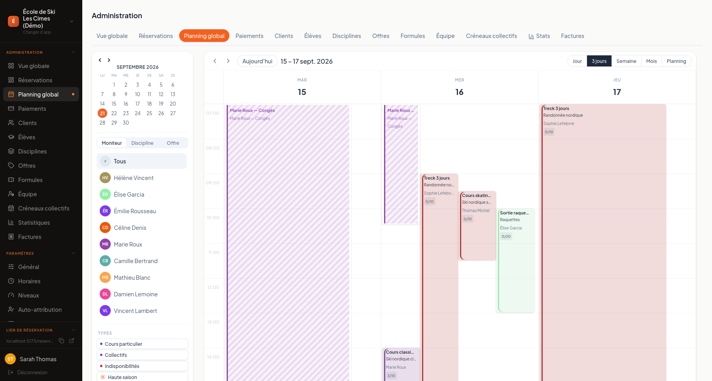
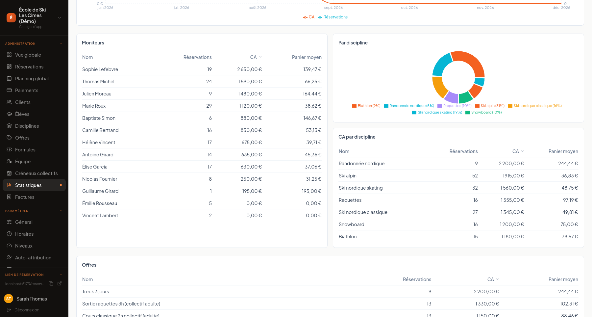

  

# Krenolis

Plateforme de réservation, planning d'équipes, encaissement et facturation pour les activités
saisonnières qui emploient des intervenants indépendants — écoles de ski, écoles de musique,
studios de yoga.

**Site : https://krenolis.fr**

Ce dépôt est un dépôt de présentation — le code source est privé.

## Ce que ça résout

- Un moniteur freelance qui travaille pour deux écoles clientes ne peut pas être réservé au même
  horaire sur les deux, sans qu'aucune des deux structures ne voie le planning de l'autre.
- La tarification bascule automatiquement en haute/basse saison, sans configuration manuelle.
- La conformité fiscale française (NF525, facturation séquentielle) est intégrée par défaut, pas
  en option.
- Paiement en ligne par carte (Stripe Connect) ou encaissement manuel, au choix de la structure.

## Aperçu

  
   <em>Conformité NF525 : intégrité du journal de caisse vérifiée par chaîne de hachage SHA-256</em>

  
   <em>Planning global multi-moniteurs</em>

  
   <em>Statistiques : chiffre d'affaires par moniteur et par discipline</em>

*Captures réalisées sur le tenant de démonstration, avec des données fictives.*

## Stack

React, TypeScript, Vite, Firebase (Firestore, Functions, Hosting), Stripe Connect.

---

Développé en marge de mon cursus à 42 Lausanne, en m'appuyant largement sur des outils d'IA pour
l'implémentation afin de me concentrer sur l'architecture, la logique métier et la conformité
légale.
